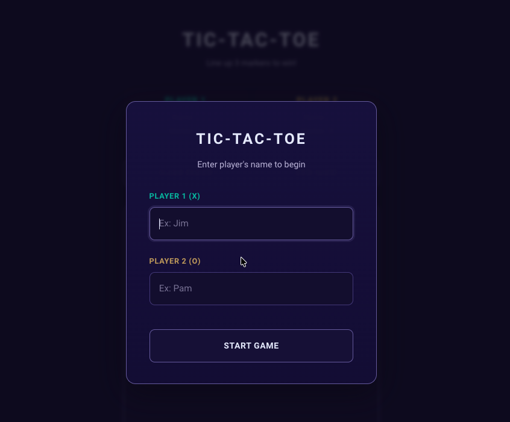
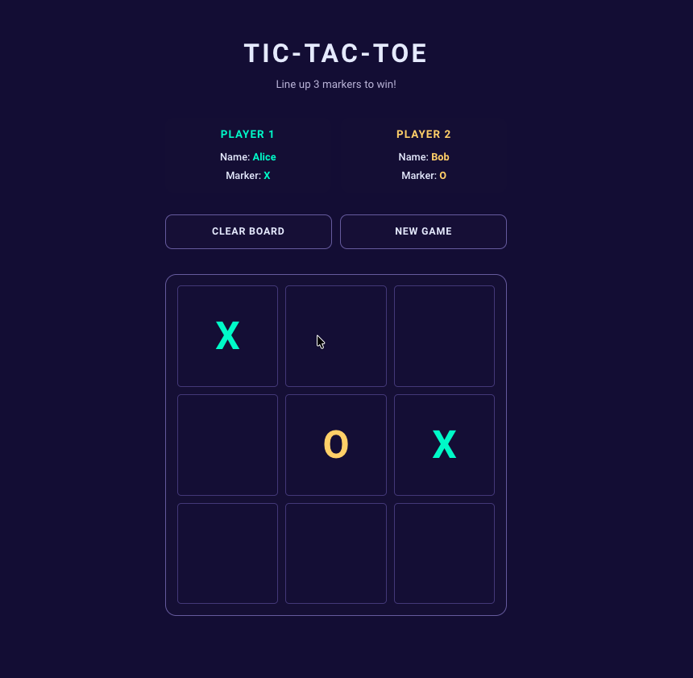

# Tic-Tac-Toe Web App

A small interactive browser-based Tic-Tac-Toe game for two players. Players enter their names, take turns placing X and O markers, and the app checks for wins, ties, board clears, new rounds, and full new games.

There is no backend, build step, or external framework here – the whole app is plain HTML, CSS, and JavaScript. The interface uses native `<dialog>` elements for player setup and end-of-round messages, with a compact CSS Grid layout that keeps the board centered and easy to read.

This was built as a learning / portfolio piece through **The Odin Project**, with my own styling and JavaScript structure. If you are reading through the code, the main focus is separation of concerns: the board stores state, the game controller owns the rules, and the UI controller handles DOM rendering and user events.

<p align="center">
  
  
</p>

#### Key engineering concepts used in this project

- Factory functions for `gameBoard` and `player` objects
- Closure-based private state for the board array, player data, and active game flow
- IIFE modules for `gameController` and `uiController`
- Clear controller boundary: the UI talks to the game controller instead of mutating the board directly
- Event-driven UI with board click handling, form submission, and action buttons
- Native `<dialog>` elements for player setup and round result messages
- CSS custom properties and CSS Grid for a consistent, responsive interface

## Getting Started

### **Try it online**

**Live app:** [https://soikat27.github.io/tic-tac-toe-web](https://soikat27.github.io/tic-tac-toe-web) - opens in the browser, nothing to install.

### **Run it locally** (if you are cloning or tweaking the code)

You do not need Node, npm, a bundler, Python, or a local server right now - just a browser and a copy of the files.

#### **Prerequisites**

- A **modern browser** (recent Chrome, Firefox, Safari, or Edge)
- **Git** (only if you clone the repo; otherwise you can use GitHub's **Code -> Download ZIP**)

#### Check that Git is installed (only if you clone)

```bash
git --version
```

#### **Installing**

##### 1. Clone this repository and open the project directory

```bash
git clone https://github.com/soikat27/tic-tac-toe-web.git
```

```bash
cd tic-tac-toe-web
```

There is no `npm install` or compile step - just static HTML, CSS, and JavaScript.

#### **Running locally**

Open `index.html` in your browser by double-clicking it or dragging it into a browser window.

## Using the app

The same behavior applies on the [live demo](https://soikat27.github.io/tic-tac-toe-web/) and when you run the files locally.

### Features

- **Player setup** - enter names for Player 1 and Player 2 before the game starts
- **Turn-based play** - players alternate between X and O markers
- **Win detection** - the game checks all rows, columns, and diagonals
- **Tie detection** - the app recognizes a full board with no winner
- **Clear Board** - reset the current board while keeping the same players
- **New Round** - start another round after a win or tie
- **New Game** - reset the board and enter new player names

### Usage

- Enter both player names in the opening dialog and click **Start Game**
- Click an empty board square to place the current player's marker
- Line up three matching markers horizontally, vertically, or diagonally to win
- Use **Clear Board** to reset the board during a game
- Use **New Game** to restart with new player names
- After a completed round, click **New Round** to play again with the same players

### Upcoming features

- Add a score tracker across rounds
- Highlight the winning row, column, or diagonal
- Improve keyboard accessibility for board cells
- Add optional local persistence for player names or match history

## Deployment

This project is static files only. It is designed to be served with **GitHub Pages** at [https://soikat27.github.io/tic-tac-toe-web](https://soikat27.github.io/tic-tac-toe-web) using the repo root, with no build step required.

The same files could also be hosted on Netlify, Cloudflare Pages, Vercel, or any other static hosting service.

## Built with

- Plain **HTML**, **CSS**, and **JavaScript**
- **Factory functions** for board and player creation
- **IIFE modules** for game and UI controllers
- **CSS Grid** for the board and layout
- **CSS custom properties** for theme colors
- Native **`<dialog>`** elements for modal flows

## Contributing

Contributions are welcome and appreciated. Feel free to open an issue or send a PR if you want to improve accessibility, add score tracking, polish the UI, or suggest a cleaner approach.

## Author

- **Soikat Saha** - design and implementation

## License

This project is licensed under the MIT License - see the [LICENSE](LICENSE) file for details.

## Acknowledgments

- Shoutout to **The Odin Project** community and curriculum for the project guidance.
- Thanks to **MDN Web Docs** for clear references on DOM APIs, forms, and native dialogs.
- The plain HTML, CSS, and JavaScript approach is intentional - it keeps the project lightweight and makes the application structure easy to inspect.